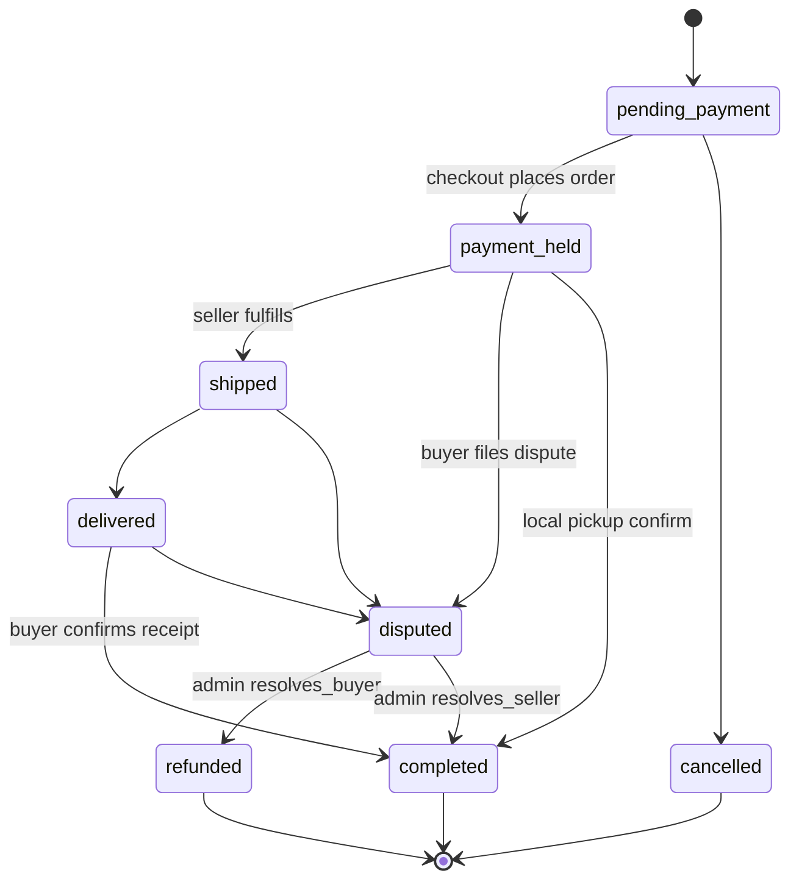
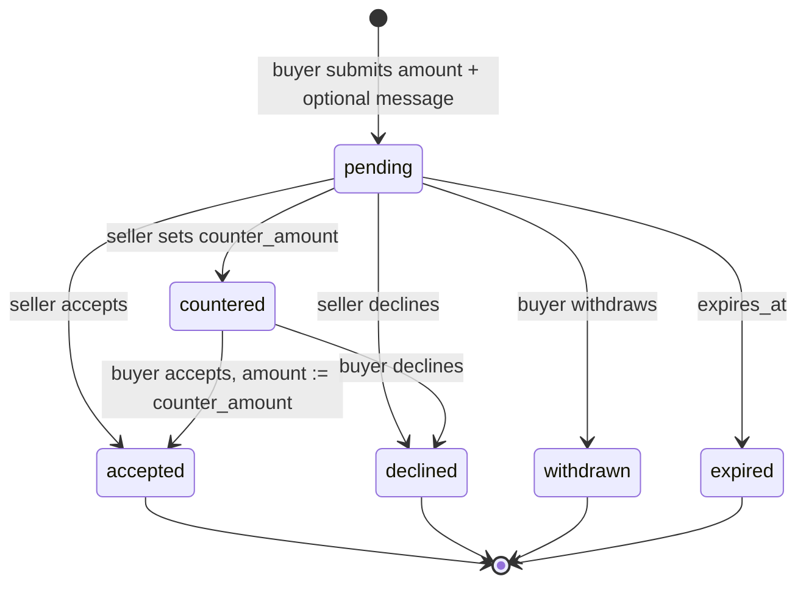

# TradeVault

**TradeVault** (Base44 project name: **MarketFlow**) is a verified-seller C2C marketplace. Buyers browse listings, negotiate via offers and counteroffers, and pay into an escrow-style transaction that only settles after receipt is confirmed. Sellers must complete identity verification before listing. Admins review KYC documents, moderate listings, and adjudicate disputes against private evidence.

The consumer UI is a Vite + React SPA. Persistence, auth, file storage, email, and scheduled automation run on [Base44](https://base44.com) — entities with row-level security, Deno backend functions, and an entity-triggered workflow.

Production app: [smart-trade-flow-app.base44.app](https://smart-trade-flow-app.base44.app)

---

## Architecture

```
┌──────────────────────────────────────────────────────────────────┐
│                         Browser (SPA)                            │
│  React 18 · React Router 7 · TanStack Query · Radix / shadcn-ui  │
│                                                                  │
│  AuthContext ──► public-settings + /auth/me                      │
│  base44 SDK  ──► entities · functions · integrations · subscribe │
└─────────────┬─────────────────────────────┬──────────────────────┘
              │ HTTPS (session token)       │ Vite plugin proxy
              ▼                             ▼
┌─────────────────────────┐    ┌───────────────────────────────────┐
│  Base44 Platform        │    │  Local Vite (@base44/vite-plugin) │
│                         │    │  HMR · analytics · visual edits   │
│  • Auth / OAuth         │    └───────────────────────────────────┘
│  • Entity store + RLS   │
│  • Private file bucket  │    ┌───────────────────────────────────┐
│  • Core integrations    │    │  Backend functions (Deno)         │
│    UploadPrivateFile    │    │  processVerificationEvent         │
│    CreateFileSignedUrl  │    │  createSecureFileUrl              │
│    SendEmail            │    │  sendReviewReminder               │
│  • Realtime subscribe   │    └───────────────────────────────────┘
│  • Workflow engine      │              ▲
└─────────────────────────┘              │ invoke_backend_function
                                         │
                           ┌─────────────┴─────────────────────────┐
                           │  Workflow: Review Reminder            │
                           │  trigger: Transaction.update          │
                           │  when status flips to "completed"     │
                           └───────────────────────────────────────┘
```

The SPA never talks to a custom REST API of its own. All reads and writes go through `createClient()` from `@base44/sdk`. Privileged work (admin emails, signed URLs, review reminders) runs in backend functions that mint a **service-role** client via `createClientFromRequest(req).asServiceRole`.

---

## Tech stack

| Layer | Choice |
|---|---|
| UI | React 18, React Router 7, Tailwind CSS 3, shadcn/ui (New York / Radix) |
| Data fetching | TanStack Query 5 (shared `QueryClient`; `refetchOnWindowFocus: false`) |
| Forms / validation | react-hook-form, Zod, `@hookform/resolvers` |
| Charts | Recharts |
| Motion / UX | Framer Motion, Sonner toasts, canvas-confetti |
| Backend BaaS | Base44 SDK `^0.8.48`, Vite plugin `@base44/vite-plugin` |
| Payments | Stripe packages are present; checkout currently **simulates** escrow (`status: payment_held`) |
| Tooling | Vite 8, ESLint 9, TypeScript check via `jsconfig.json` (`checkJs: true`) |
| Fonts | Inter (body) + Syne (display), gold/amber primary on a dark HSL token system |

Path alias: `@/*` → `./src/*`.

---

## Repository layout

```
.
├── base44/
│   ├── config.jsonc                 # App name, install/build/serve commands
│   ├── entities/*.jsonc             # Schema + RLS for every domain object
│   ├── functions/*/entry.ts         # Deno backend functions
│   └── workflows/Review Reminder.jsonc
├── src/
│   ├── api/base44Client.js          # Singleton SDK client
│   ├── lib/                         # Auth, app params, signed-file helper
│   ├── pages/                       # Route-level screens
│   ├── components/                  # Domain UI + shadcn primitives
│   └── hooks/useFavorites.js
├── vite.config.js                   # React + Base44 plugin (HMR, analytics)
├── components.json                  # shadcn generator config
└── package.json
```

Pushes to this repo sync into the Base44 Builder. Publish from [Base44.com](https://base44.com).

---

## Domain model

Nine entities. Schemas live in `base44/entities/*.jsonc`. Base44 injects `id`, `created_date`, and related audit fields at rest.

| Entity | Purpose | Key fields |
|---|---|---|
| **User** | Profile + KYC state | `role` (`user` \| `admin`), `verification_status`, `account_type`, `rating`, `total_sales` |
| **Listing** | Catalog item | `category`, `condition`, `price`, `delivery_type`, `status`, `allows_offers`, `auction_enabled`, `view_count` |
| **Offer** | Bid / negotiation | `amount`, `status`, `counter_amount`, `counter_message`, `is_bid`, `expires_at` |
| **Transaction** | Escrow record | `amount`, `platform_fee`, `seller_payout`, `delivery_type`, `status`, `tracking_number` |
| **Dispute** | Chargeback analogue | `reason`, `evidence_urls[]`, `status`, `refund_amount`, `admin_notes` |
| **Review** | Post-completion rating | `rating`, `role` (`buyer` \| `seller`), `transaction_id` |
| **Message** | Listing-scoped chat | `conversation_id`, `read`, `listing_id` |
| **Favorite** | Watchlist | `(user_id, listing_id)` |
| **VerificationRequest** | KYC packet | `account_type`, `id_document_url`, `business_document_url`, `status` |

### Listing taxonomy

- **Categories:** `electronics`, `vehicles`, `clothing`, `home_garden`, `sports`, `toys`, `books`, `music`, `art`, `jewelry`, `collectibles`, `other`
- **Condition:** `new` → `like_new` → `good` → `fair` → `poor`
- **Delivery:** `local_pickup` \| `shipping` \| `both`
- **Listing status:** `active` \| `pending` (checkout started) \| `sold` \| `draft` \| `removed`

Sellers are gated in `CreateListing`: if `user.verification_status !== 'verified'`, the form toasts and points at `/verification`. Listing photos use **public** `UploadFile` (catalog images are meant to be world-readable). KYC and dispute evidence use **private** `UploadPrivateFile`.

### Row-level security

RLS is declared on the entity, not in the SPA. The SDK’s user-scoped client can only see what the policy allows; backend functions that need to fan out to admins or resolve owner emails call `asServiceRole`.

| Entity | create | read | update / delete |
|---|---|---|---|
| Listing | `seller_id == me` | public | seller **or** admin |
| Transaction | `buyer_id == me` | buyer, seller, or admin | same |
| Offer | `buyer_id == me` | buyer, seller, or admin | same |
| Dispute | `buyer_id == me` | buyer, seller, or admin | **admin only** |
| Review | `reviewer_id == me` | public | reviewer or admin |
| Message | `sender_id == me` | sender, recipient, or admin | same |
| Favorite | `user_id == me` | owner only | owner only |
| VerificationRequest | `user_id == me` | owner or admin | owner or admin |

`createSecureFileUrl` relies on this: it loads the VerificationRequest / Dispute with the **user-scoped** client. If RLS hides the row, the function returns 404 and never issues a signed URL.

---

## Security model

### Authentication bootstrap

`AuthProvider` (`src/lib/AuthContext.jsx`) is a two-phase gate:

1. **Public settings** — `GET /api/apps/public/prod/public-settings/by-id/:appId` with `X-App-Id`. A `403` with `reason: auth_required` redirects to Base44 login; `user_not_registered` renders `UserNotRegisteredError`.
2. **Session** — if an access token exists, `base44.auth.me()` hydrates the user. Tokens arrive as `?access_token=` (stripped from the URL and cached in `localStorage` as `base44_access_token`) or from `VITE_BASE44_APP_ID` / env defaults. `?clear_access_token=true` wipes the cache.

App identity is assembled in `src/lib/app-params.js`: URL query → `localStorage` → Vite env. The SDK client is created with `requiresAuth: false` so unauthenticated browsing of public listings still works; individual pages call `redirectToLogin()` when they need a session.

Admin routes (`/admin`, `/admin/disputes`) additionally check `user.role === 'admin'` client-side and bounce to `/`. Destructive dispute mutations are still enforced by RLS (`update`/`delete` = admin only).

### Private documents and signed URLs

ID scans, business docs, and dispute evidence are **not** public object URLs.

```
UploadPrivateFile  →  file_uri stored on the entity
                         │
                         ▼
createSecureFileUrl (authenticated)
  1. auth.me()                         → 401 if missing
  2. entities.{VerificationRequest|Dispute}.get(id)
       (user-scoped → RLS)             → 404 if not owner/party/admin
  3. file_uri ∈ attached documents     → 403 if not on this record
  4. http(s) URI (legacy public)       → returned as-is
     otherwise CreateFileSignedUrl     → 300s signed URL
```

The SPA never embeds private `file_uri`s in ``. `ViewDocButton` / `EvidenceGrid` call `getSignedFileUrl()` (`src/lib/secureFiles.js`) and open the short-lived URL in a new tab.

### Email integrity

`processVerificationEvent` does **not** trust client-supplied `user_email` on the VerificationRequest. After an admin decision it re-resolves the owner via `User.filter({ id: vr.user_id })` as service role and mails that address. `sendReviewReminder` similarly loads the buyer from `tx.buyer_id` and HTML-escapes name/title/seller before interpolating into the template (XSS in outbound mail).

Authorization inside functions:

| Function | Who may call | Guard |
|---|---|---|
| `processVerificationEvent` (pending) | Request owner | `vr.user_id === user.id` |
| `processVerificationEvent` (approved/rejected) | Admin | `user.role === 'admin'` |
| `createSecureFileUrl` | Authenticated party | RLS + attachment allow-list |
| `sendReviewReminder` | Workflow (no user) | Transaction must exist, `status === completed`, no existing Review |

---

## Transaction lifecycle (escrow)

Checkout computes a **5% platform fee** on item price (`PLATFORM_FEE_PERCENT = 0.05`), rounded to cents. Buyer pays `price + shipping`; seller payout is `total - platformFee`. The listing is flipped to `pending`.



Current UI paths:

- **Place order** (`Checkout`) → create Transaction `payment_held`, listing `pending`.
- **Confirm receipt** (`Orders`, buyer, status `delivered`) → `completed`. Toast: funds released.
- **File dispute** (`DisputeDialog`) from `payment_held` \| `shipped` \| `delivered` → Dispute `open` + Transaction `disputed`.
- **Admin resolve** (`DisputeCard`) → buyer win: Transaction `refunded` (optional partial `refund_amount`); seller win: Transaction `completed`.

The `Review Reminder` workflow fires **only** on the `* → completed` edge (`new status == completed AND old status != completed`).

Stripe is **not wired** yet. Checkout copy states that production will connect to Stripe; the Transaction is created directly with `payment_held`.

---

## Offer negotiation

Listings with `allows_offers` expose an offer dialog on `ListingDetail`. Offers are a first-class entity, not messages.



`Listing.auction_enabled` / `starting_bid` / `auction_end_date` exist on the schema and are shown as a badge, but there is no separate auction clock or bid-increment engine in the SPA yet. `Offer.is_bid` is reserved for that path.

---

## Identity verification

```mermaid
sequenceDiagram
    participant U as Seller
    participant SPA as Verification.jsx
    participant E as VerificationRequest
    participant F as processVerificationEvent
    participant A as Admin Panel

    U->>SPA: UploadPrivateFile (ID, optional business doc)
    SPA->>E: create(status=pending)
    SPA->>SPA: auth.updateMe(verification_status=pending)
    SPA->>F: invoke(request_id, event_type=create)
    F->>F: RLS read + owner check
    F->>A: SendEmail to every role=admin
    A->>E: update(approved|rejected) + admin_notes
    A->>A: User.verification_status = verified|rejected
    A->>F: invoke(event_type=update)
    F->>F: require admin; resolve owner from User
    F->>U: SendEmail (never uses client-supplied email)
```

Statuses on User: `unverified` → `pending` → `verified` \| `rejected`. Rejected users can resubmit; the form surfaces `admin_notes`.

---

## Dispute resolution

Buyers attach up to **5** private evidence photos. Reasons: `item_not_received`, `item_not_as_described`, `damaged_item`, `wrong_item`, `other`.

Admins work from `/admin` (tab) and `/admin/disputes` (dedicated dashboard with amount-at-stake). `DisputeCard` can:

- Mark under review (status `under_review`)
- Full refund → `resolved_buyer` + Transaction `refunded`
- Partial refund → `resolved_buyer` with `refund_amount ≤ dispute.amount`
- Release to seller → `resolved_seller` + Transaction `completed`

Dispute **updates and deletes are admin-only in RLS**, so a buyer cannot rewrite their own case after filing.

---

## Real-time messaging

Conversation IDs are deterministic:

```text
[userId, sellerId].sort().join('_') + '_' + listingId
```

That keeps a single thread per buyer–seller–listing triple. `AskSellerThread` on the listing page and `Messages` both subscribe to `base44.entities.Message.subscribe`. The nav badge increments on `create` where `recipient_id === me && !read`, and decrements on `update` when `read` becomes true.

Inbox assembly (`Messages.buildConversations`) unions sent + received (200 each, newest first), groups by `conversation_id`, and tracks unread per thread.

---

## Backend functions

Deno modules under `base44/functions/*/entry.ts`. Invoked from the SPA with `base44.functions.invoke(name, args)` or from a workflow via `invoke_backend_function`.

### `processVerificationEvent`

```ts
{ request_id: string, event_type?: 'create' | 'update' }
```

- **401** no session
- **404** RLS hid the VerificationRequest
- **403** pending but caller is not owner; or decision but caller is not admin
- Pending → email all `User.role === 'admin'`
- Approved / rejected → email the **resolved** owner; skip if `event_type !== 'update'`

### `createSecureFileUrl`

```ts
{ record_type: 'verification' | 'dispute', record_id: string, file_uri: string }
```

See [Private documents](#private-documents-and-signed-urls). `expires_in: 300`.

### `sendReviewReminder`

```ts
{ transaction_id: string }
```

Designed for unattended workflow invocation. Early-outs (all `sent: false`):

| `reason` | Meaning |
|---|---|
| `transaction_not_found` | Bad id |
| `transaction_not_completed` | Status has not actually landed on `completed` |
| `review_already_exists` | Duplicate-guard: a Review already references this transaction |
| `buyer_email_unavailable` | Buyer record missing email |

On success, HTML mail with CTA to `/orders`.

### Workflow: Review Reminder

`base44/workflows/Review Reminder.jsonc` — DSL `1.2`.

- **Trigger:** `Transaction` `update`
- **Condition:** `${ .trigger.data.status == "completed" and .trigger.old_data.status != "completed" }`
- **Action:** `invoke_backend_function` `sendReviewReminder` with `transaction_id = trigger.entity_id`

---

## Frontend architecture

### Routing

All product routes sit under `Layout` (sticky nav, `NavSearch`, unread badge, footer). Catch-all → `PageNotFound`.

| Path | Screen | Auth |
|---|---|---|
| `/` | Home — featured (`-view_count`) + recent (`-created_date`) | public |
| `/browse` | Faceted catalog | public |
| `/listing/:id` | Gallery, offer, buy, ask-seller | public; mutations need login |
| `/create-listing` | New listing (max 8 images) | verified seller |
| `/checkout/:id` | Escrow checkout | login |
| `/orders` | Purchases, sales, offer inbox | login |
| `/messages` | Conversation list + thread | login |
| `/profile/:id` | Public profile, listings, reviews | public |
| `/verification` | KYC upload | login |
| `/my-listings` | Seller inventory CRUD-ish | login |
| `/favorites` | Watchlist via `useFavorites` | login |
| `/analytics` | Seller revenue / views (last 6 months) | login |
| `/admin` | Verifications, disputes, listing takedowns | admin |
| `/admin/disputes` | Dispute ops dashboard | admin |

`OAuthConsent.jsx` exists for the app MCP consent screen (`ctx` handle against `/api/apps/:id/mcp/consent-info`) but is not registered in `App.jsx` routes.

### Browse pipeline

Server filter first (`status: active` + optional category / delivery / condition, sort `-view_count` or `-created_date`, limit 40), then **client-side** refinement: substring match on title / description / tags, location contains, inclusive price band. Query string keys: `q`, `category`, `location`, `sort`, `minPrice`, `maxPrice`.

### Seller analytics

`Analytics` loads the caller’s completed transactions (200), listings (100), and inbound reviews (100). Derived metrics: total revenue (`seller_payout` fallback `amount`), AOV, total views, monthly Recharts series (`date-fns` `startOfMonth`/`endOfMonth` over 6 months), top listings by matched sales volume.

### Optimistic favorites

`useFavorites` maps `listing_id → favorite record id`. Toggle deletes or creates immediately in local state, then persists. Unauthenticated toggle redirects to login.

---

## Local development

**Prerequisites:** Node.js 18+ and npm.

```bash
git clone <repo-url>
cd marketflow
npm install
```

Create `.env.local` (gitignored):

```bash
VITE_BASE44_APP_ID=your_app_id
VITE_BASE44_APP_BASE_URL=https://your-app.base44.app
# optional
VITE_BASE44_FUNCTIONS_VERSION=
```

```bash
npm run dev      # Vite + Base44 plugin (HMR, navigation notifier, analytics)
npm run build    # production bundle → ./dist
npm run preview  # serve dist
npm run lint     # ESLint (pages + components; ui/ and lib/ excluded)
npm run typecheck
```

`base44/config.jsonc` mirrors these: install `npm install`, build `npm run build`, serve `npm run dev`, output `./dist`.

Optional Vite plugin flag: `BASE44_LEGACY_SDK_IMPORTS=true` rewrites `@/integrations` / `@/entities` imports for older generated code. This tree uses `@base44/sdk` directly.

### SDK client

```js
// src/api/base44Client.js
export const base44 = createClient({
  appId, token, functionsVersion,
  serverUrl: '',
  requiresAuth: false,
  appBaseUrl,
});
```

Empty `serverUrl` lets the Vite plugin proxy `/api` to the Base44 backend.

---

## Environment & secrets

| Variable | Where | Role |
|---|---|---|
| `VITE_BASE44_APP_ID` | `.env.local` | App identity header + public-settings lookup |
| `VITE_BASE44_APP_BASE_URL` | `.env.local` | Hosted backend origin |
| `VITE_BASE44_FUNCTIONS_VERSION` | `.env.local` | Pin function deployment |
| `access_token` (query) | runtime | Session; stripped from URL, stored as `base44_access_token` |
| Workflow secret | Base44 Builder | Authenticates unattended `sendReviewReminder` invocations |

Do not commit `.env`, `.env.*`, or `base44/.app.jsonc`.

---

## Operational notes

- **View counts** increment with a fire-and-forget `Listing.update` on detail mount (subject to listing RLS: only the seller or an admin can write — anonymous views may not persist).
- **Checkout is not idempotent** at the entity layer: repeating Place Order creates another Transaction. Listing status is set to `pending` after the first.
- **Reviews** are buyer-only in the current Orders UI (`role: 'buyer'`). The schema also allows `seller`.
- **MCP OAuth consent** page is implemented but not mounted in the router.
- **Auction fields** are stored and displayed; bidding runtime is incomplete.

---

## Docs & support

- Base44 GitHub integration: [docs.base44.com/Integrations/Using-GitHub](https://docs.base44.com/Integrations/Using-GitHub)
- Support: [app.base44.com/support](https://app.base44.com/support)
- Publish: open the project on [Base44.com](https://base44.com) and click **Publish**.
