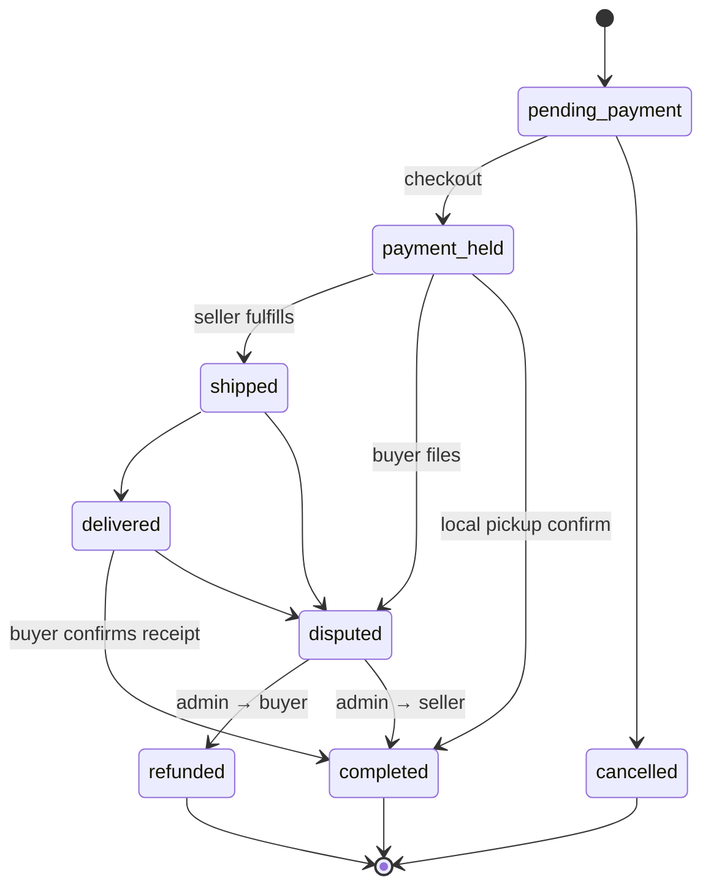
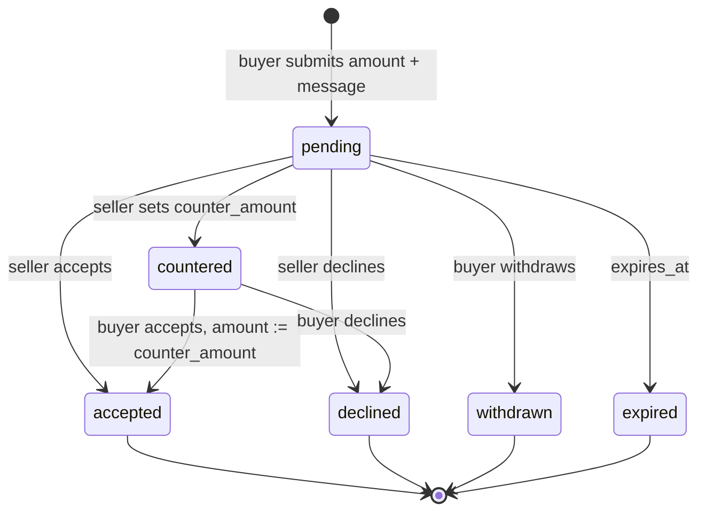

```
00000000  54 72 61 64 65 56 61 75  6c 74 20 7c 20 43 32 43  |TradeVault | C2C|
00000010  20 4d 61 72 6b 65 74 70  6c 61 63 65 20 7c 20 4b  | Marketplace | K|
00000020  59 43 20 2b 20 45 73 63  72 6f 77 0a              |YC + Escrow.|
```

<pre align="center">
<code>
 ████████╗██████╗  █████╗ ██████╗ ███████╗██╗   ██╗ █████╗ ██╗   ██╗██╗  ████████╗
 ╚══██╔══╝██╔══██╗██╔══██╗██╔══██╗██╔════╝██║   ██║██╔══██╗██║   ██║██║  ╚══██╔══╝
    ██║   ██████╔╝███████║██║  ██║█████╗  ██║   ██║███████║██║   ██║██║     ██║
    ██║   ██╔══██╗██╔══██║██║  ██║██╔══╝  ╚██╗ ██╔╝██╔══██║██║   ██║██║     ██║
    ██║   ██║  ██║██║  ██║██████╔╝███████╗ ╚████╔╝ ██║  ██║╚██████╔╝███████╗██║
    ╚═╝   ╚═╝  ╚═╝╚═╝  ╚═╝╚═════╝ ╚══════╝  ╚═══╝  ╚═╝  ╚═╝ ╚═════╝ ╚══════╝╚═╝

        identity-verified C2C marketplace  ·  escrow settlement  ·  private evidence
</code>
</pre>

```
┌──(operator㉿tradevault)-[~]
└─# uname -a
Linux tradevault 6.12 marketplace #1 SMP x86_64 GNU/Linux

┌──(operator㉿tradevault)-[~]
└─# whoami && id
operator
uid=1000(operator) gid=1000(marketplace) groups=1000(marketplace),27(sudo),133(kyc),150(escrow)

┌──(operator㉿tradevault)-[~]
└─# nmap -sV --top-ports 8 localhost
PORT     STATE SERVICE          VERSION
443/tcp  open  https            SPA (React 18 / Vite 8)
5173/tcp open  http-proxy       local API tunnel
8000/tcp open  entity-store     RLS-backed catalog + orders
8001/tcp open  edge-fn          Deno: KYC / signed files / mail
8002/tcp open  workflow         Transaction.completed → review ping
8003/tcp open  object-store     public catalog + private KYC/evidence
8004/tcp open  realtime         Message.subscribe (unread badge)
8005/tcp open  identity         OAuth session + role=user|admin
```

<p align="center">
  
  
  
  
</p>

---

```
┌──(operator㉿tradevault)-[~/man]
└─# man tradevault | head -n 40
```

```
TRADEVAULT(1)                    Marketplace Ops                    TRADEVAULT(1)

NAME
       TradeVault — verified-seller C2C marketplace with escrow settlement

SYNOPSIS
       buy     browse → listing → offer|checkout → payment_held → confirm
       sell    kyc → listing → negotiate → ship/pickup → payout
       admin   verify identity · adjudicate disputes · take down listings

DESCRIPTION
       TradeVault is a premium peer-to-peer marketplace. Buyers search a
       faceted catalog, negotiate via offers and counteroffers, and pay into
       an escrow-style transaction that settles only after receipt is
       confirmed. Sellers cannot list until identity verification clears.
       Operators review KYC packets, moderate inventory, and resolve disputes
       against private photographic evidence.

       The client is a Vite + React 18 SPA. Persistence, identity, object
       storage, mail, realtime, and event-driven automation run behind a
       typed entity store with row-level security and Deno edge functions.

EXIT STATUS
       401     no session
       403     RLS / role / attachment allow-list denied
       404     row hidden by policy (treated as not found)

SEE ALSO
       escrow(7), kyc(7), rls(5), listing(5)

TradeVault                          2026-09                         TRADEVAULT(1)
```

---

## 0x01  reconnaissance

```
┌──(operator㉿tradevault)-[~/src]
└─# cat /etc/tradevault/stack.conf
```

| Layer | Payload |
| --- | --- |
| Client | React 18 · React Router 7 · Tailwind 3 · shadcn/ui (New York / Radix) |
| Cache | TanStack Query 5 (`refetchOnWindowFocus: false`, retry 1) |
| Forms | react-hook-form · Zod |
| Charts | Recharts (seller analytics, 6-month window) |
| Motion | Framer Motion · Sonner · canvas-confetti |
| Settlement | Stripe packages present; checkout currently writes `payment_held` directly |
| Toolchain | Vite 8 · ESLint 9 · `jsconfig.json` (`checkJs: true`) |
| Type | Inter body / Syne display · gold-on-obsidian HSL tokens |

Alias: `@/*` → `./src/*`.

```
┌──(operator㉿tradevault)-[~]
└─# tree -L 2 --noreport
.
├── src/
│   ├── api/                 singleton marketplace client
│   ├── lib/                 auth gate, app params, signed-file helper
│   ├── pages/               route-level screens
│   ├── components/          domain UI + primitives
│   └── hooks/               useFavorites
├── entities/                JSONC schemas + RLS
├── functions/               Deno edge functions
├── workflows/               entity-triggered automation
├── vite.config.js
├── components.json
└── package.json
```

---

## 0x02  architecture

```
┌──(operator㉿tradevault)-[~]
└─# tshark -q -z conv,tcp 2>/dev/null; cat <<'EOF'
```

```
  ┌─────────────────────────────────────────────────────────────────────┐
  │  BROWSER                                                            │
  │  React 18  ·  Router 7  ·  Query  ·  Radix                          │
  │                                                                     │
  │  AuthProvider ──► public-settings  then  /auth/me                   │
  │  client       ──► entities · functions · storage · subscribe        │
  └──────────────┬───────────────────────────────┬──────────────────────┘
                 │ TLS + session token           │ local proxy
                 ▼                               ▼
  ┌──────────────────────────┐     ┌────────────────────────────────────┐
  │  PLATFORM                │     │  VITE DEV                          │
  │  identity / OAuth        │     │  HMR · navigation hooks            │
  │  entity store + RLS      │     └────────────────────────────────────┘
  │  private object bucket   │
  │  UploadPrivateFile       │     ┌────────────────────────────────────┐
  │  CreateFileSignedUrl     │     │  EDGE FUNCTIONS (Deno)             │
  │  SendEmail               │     │  processVerificationEvent          │
  │  realtime subscribe      │     │  createSecureFileUrl               │
  │  workflow engine         │     │  sendReviewReminder                │
  └──────────────┬───────────┘     └────────────────▲───────────────────┘
                 │                                  │
                 │  Transaction.status → completed  │ invoke
                 └──────────────────────────────────┘
```

The SPA has no bespoke REST surface. Reads and writes go through the platform client. Privileged work (operator mail, signed URLs, review reminders) runs in edge functions that mint a **service-role** client — never from the browser.

---

## 0x03  data plane

Nine entities. Platform injects `id` and `created_date` at rest.

```
┌──(operator㉿tradevault)-[~/entities]
└─# xxd -l 16 User.jsonc Listing.jsonc Transaction.jsonc
```

| Entity | Mission | Primary fields |
| --- | --- | --- |
| **User** | Identity + KYC state | `role` (`user` \| `admin`), `verification_status`, `account_type`, `rating`, `total_sales` |
| **Listing** | Catalog SKU | `category`, `condition`, `price`, `delivery_type`, `status`, `allows_offers`, `auction_enabled`, `view_count` |
| **Offer** | Negotiation | `amount`, `status`, `counter_amount`, `counter_message`, `is_bid`, `expires_at` |
| **Transaction** | Escrow ledger | `amount`, `platform_fee`, `seller_payout`, `delivery_type`, `status`, `tracking_number` |
| **Dispute** | Chargeback analogue | `reason`, `evidence_urls[]`, `status`, `refund_amount`, `admin_notes` |
| **Review** | Post-settlement score | `rating`, `role` (`buyer` \| `seller`), `transaction_id` |
| **Message** | Listing-scoped thread | `conversation_id`, `read`, `listing_id` |
| **Favorite** | Watchlist | `(user_id, listing_id)` |
| **VerificationRequest** | KYC packet | `account_type`, `id_document_url`, `business_document_url`, `status` |

### listing taxonomy

```
┌──(operator㉿tradevault)-[~]
└─# cat /etc/tradevault/taxonomy
category   electronics vehicles clothing home_garden sports toys
           books music art jewelry collectibles other
condition  new > like_new > good > fair > poor
delivery   local_pickup | shipping | both
l.status   active | pending | sold | draft | removed
```

`CreateListing` refuses unverified sellers (`verification_status !== 'verified'`) and redirects to `/verification`. Catalog photos are public objects. KYC scans and dispute evidence are **private**.

### row-level security

Policy lives on the entity, not in the SPA. The user-scoped client sees only what RLS permits. Fan-out mail and owner-email resolution use service role.

```
┌──(operator㉿tradevault)-[~]
└─# iptables -L RLS -n -v
```

| Entity | CREATE | READ | UPDATE / DELETE |
| --- | --- | --- | --- |
| Listing | `seller_id == me` | public | seller **or** admin |
| Transaction | `buyer_id == me` | buyer, seller, admin | same |
| Offer | `buyer_id == me` | buyer, seller, admin | same |
| Dispute | `buyer_id == me` | buyer, seller, admin | **admin only** |
| Review | `reviewer_id == me` | public | reviewer or admin |
| Message | `sender_id == me` | sender, recipient, admin | same |
| Favorite | `user_id == me` | owner | owner |
| VerificationRequest | `user_id == me` | owner or admin | owner or admin |

`createSecureFileUrl` loads VerificationRequest / Dispute on the **user-scoped** client. If RLS hides the row, the function returns **404** and never mints a signed URL.

---

## 0x04  security

```
┌──(operator㉿tradevault)-[~]
└─# lynis audit system --quick 2>/dev/null | sed -n '1,12p'
```

### identity bootstrap

`AuthProvider` (`src/lib/AuthContext.jsx`) is a two-phase gate:

1. **Public settings** — `GET …/public-settings/by-id/:appId`. `403 auth_required` → login redirect. `user_not_registered` → dedicated error surface.
2. **Session** — if a token exists, `auth.me()` hydrates the operator. Tokens arrive as `?access_token=` (stripped from the URL, cached in `localStorage`) or from env defaults. `?clear_access_token=true` wipes the cache.

Identity assembly (`src/lib/app-params.js`): query string → `localStorage` → Vite env. The client is constructed with `requiresAuth: false` so the catalog is publicly browseable; mutating screens call `redirectToLogin()`.

`/admin` and `/admin/disputes` additionally require `user.role === 'admin'` in the SPA and bounce to `/`. Dispute writes are still **admin-only in RLS**.

### private objects — signed URL protocol

ID scans, business documents, and dispute evidence are never world-readable.

```
┌──(operator㉿tradevault)-[~]
└─# openssl x509 -noout -text <<<'signed-url' ; cat <<'EOF'
UploadPrivateFile
        │
        ▼  file_uri stored on the entity
createSecureFileUrl   (authenticated)
   [1]  auth.me()                                  → 401
   [2]  entities.{VerificationRequest|Dispute}.get → 404 (RLS miss)
   [3]  file_uri ∈ attached documents              → 403
   [4]  legacy http(s) URI                         → passthrough
        else CreateFileSignedUrl                   → TTL 300s
EOF
```

The SPA never puts a private `file_uri` in `img[src]`. `ViewDocButton` / `EvidenceGrid` call `getSignedFileUrl()` (`src/lib/secureFiles.js`) and open the short-lived URL in a new tab.

### mail integrity

`processVerificationEvent` does **not** trust `user_email` on the KYC row. After an operator decision it re-resolves the owner via `User.filter({ id: vr.user_id })` as service role and mails **that** address. `sendReviewReminder` loads the buyer from `tx.buyer_id` and HTML-escapes name / title / seller before interpolation (outbound XSS).

```
┌──(operator㉿tradevault)-[~]
└─# aa-status --functions
```

| Function | Caller | Guard |
| --- | --- | --- |
| `processVerificationEvent` (pending) | request owner | `vr.user_id === user.id` |
| `processVerificationEvent` (decision) | admin | `user.role === 'admin'` |
| `createSecureFileUrl` | authenticated party | RLS + attachment allow-list |
| `sendReviewReminder` | workflow (no user) | tx exists, `status=completed`, no Review yet |

---

## 0x05  escrow state machine

Checkout charges a **5% platform fee** on item price (`PLATFORM_FEE_PERCENT = 0.05`), rounded to cents. Buyer pays `price + shipping`. Seller payout is `total - platformFee`. The listing flips to `pending`.



```
┌──(operator㉿tradevault)-[~]
└─# journalctl -u escrow -o cat
[payment_held]  Checkout.jsx        create Transaction, listing → pending
[completed]     Orders.jsx          buyer confirms receipt (from delivered)
[disputed]      DisputeDialog       from payment_held | shipped | delivered
[refunded]      DisputeCard         admin resolves_buyer (optional partial)
[completed]     DisputeCard         admin resolves_seller
```

The review-reminder workflow fires **only** on the `* → completed` edge (`new == completed AND old != completed`).

Card capture is not live. Checkout copy notes production Stripe; the ledger row is created at `payment_held`.

---

## 0x06  offer negotiation

Listings with `allows_offers` expose a dialog on `ListingDetail`. Offers are a first-class entity, not chat messages.



`auction_enabled` / `starting_bid` / `auction_end_date` are stored and badged. There is no auction clock or increment engine in the SPA yet. `Offer.is_bid` is reserved.

---

## 0x07  KYC pipeline

```
┌──(operator㉿tradevault)-[~]
└─# tcpdump -nn -A port kyc
```

```mermaid
sequenceDiagram
    participant U as Seller
    participant SPA as Verification
    participant E as VerificationRequest
    participant F as processVerificationEvent
    participant A as Admin

    U->>SPA: UploadPrivateFile (ID, optional business doc)
    SPA->>E: create(status=pending)
    SPA->>SPA: auth.updateMe(verification_status=pending)
    SPA->>F: invoke(request_id, event_type=create)
    F->>F: RLS read + owner check
    F->>A: SendEmail to every role=admin
    A->>E: update(approved|rejected) + admin_notes
    A->>A: User.verification_status = verified|rejected
    A->>F: invoke(event_type=update)
    F->>F: require admin; resolve owner from User
    F->>U: SendEmail (never client-supplied address)
```

User statuses: `unverified → pending → verified | rejected`. Rejected operators resubmit; the form surfaces `admin_notes`.

---

## 0x08  disputes

Buyers attach up to **5** private evidence photos.

```
┌──(operator㉿tradevault)-[~]
└─# cat /etc/tradevault/dispute.reasons
item_not_received
item_not_as_described
damaged_item
wrong_item
other
```

Operators work `/admin` (tab) and `/admin/disputes` (amount-at-stake dashboard). `DisputeCard` can mark `under_review`, refund in full (`resolved_buyer` + Transaction `refunded`), refund partially (`refund_amount ≤ dispute.amount`), or release to seller (`resolved_seller` + Transaction `completed`).

Dispute **updates and deletes are admin-only**. A buyer cannot rewrite the case after filing.

---

## 0x09  realtime comms

Conversation IDs are deterministic:

```
┌──(operator㉿tradevault)-[~]
└─# python3 - <<'PY'
print("_".join(sorted([userId, sellerId])) + "_" + listingId)
PY
```

One thread per buyer–seller–listing triple. `AskSellerThread` and `Messages` both `Message.subscribe`. Nav badge: `+1` on `create` where `recipient_id === me && !read`; `-1` on `update` when `read` becomes true.

Inbox assembly unions sent + received (200 each, newest first), groups by `conversation_id`, tracks unread per thread.

---

## 0x0A  edge functions

Deno modules, invoked from the SPA (`functions.invoke`) or from a workflow.

### `processVerificationEvent`

```
{ request_id: string, event_type?: "create" | "update" }
```

| Code | Condition |
| --- | --- |
| 401 | no session |
| 404 | RLS hid the KYC row |
| 403 | pending but not owner, or decision but not admin |
| 200 | pending → mail all `role=admin`; decision → mail resolved owner (`event_type=update` only) |

### `createSecureFileUrl`

```
{ record_type: "verification" | "dispute", record_id: string, file_uri: string }
```

See [0x04](#0x04--security). `expires_in: 300`.

### `sendReviewReminder`

```
{ transaction_id: string }
```

Unattended. Soft-fail (`sent: false`):

| reason | Meaning |
| --- | --- |
| `transaction_not_found` | bad id |
| `transaction_not_completed` | status never landed on `completed` |
| `review_already_exists` | duplicate guard |
| `buyer_email_unavailable` | buyer has no email |

Success: HTML mail, CTA → `/orders`.

### workflow — review reminder

DSL `1.2`. Trigger: `Transaction` `update`. Condition:

```
.trigger.data.status == "completed"
and .trigger.old_data.status != "completed"
```

Action: invoke `sendReviewReminder` with `transaction_id = trigger.entity_id`.

---

## 0x0B  client routes

All product routes sit under `Layout` (sticky nav, search, unread badge, footer). Catch-all → `PageNotFound`.

```
┌──(operator㉿tradevault)-[~]
└─# ss -tlnp | awk 'NR==1 || /tradevault/'
```

| Path | Screen | Gate |
| --- | --- | --- |
| `/` | Home — featured (`-view_count`) + recent (`-created_date`) | public |
| `/browse` | Faceted catalog | public |
| `/listing/:id` | Gallery, offer, buy, ask-seller | public; writes need login |
| `/create-listing` | New listing (max 8 images) | verified seller |
| `/checkout/:id` | Escrow checkout | login |
| `/orders` | Purchases, sales, offer inbox | login |
| `/messages` | Threads | login |
| `/profile/:id` | Public profile, listings, reviews | public |
| `/verification` | KYC upload | login |
| `/my-listings` | Seller inventory | login |
| `/favorites` | Watchlist (`useFavorites`) | login |
| `/analytics` | Revenue / views, last 6 months | login |
| `/admin` | KYC, disputes, takedowns | admin |
| `/admin/disputes` | Dispute ops | admin |

`OAuthConsent.jsx` implements MCP consent (`ctx` → `/mcp/consent-info`) but is **not** mounted in the router.

### browse pipeline

Server filter first (`status: active` + optional category / delivery / condition, sort `-view_count` or `-created_date`, limit 40), then client refinement: substring on title / description / tags, location contains, inclusive price band.

Query keys: `q`, `category`, `location`, `sort`, `minPrice`, `maxPrice`.

### seller analytics

Completed transactions (200) + listings (100) + inbound reviews (100). Derived: revenue (`seller_payout` fallback `amount`), AOV, total views, monthly Recharts series (`date-fns` month bounds, 6 months), top listings by matched volume.

### favorites

`useFavorites` maps `listing_id → record id`. Toggle is optimistic, then persisted. Unauthenticated toggle → login.

---

## 0x0C  bring-up

```
┌──(operator㉿tradevault)-[~]
└─# cat /etc/os-release | grep -E 'PRETTY|Node'
PRETTY_NAME="TradeVault Marketplace"
Node.js >= 18   npm
```

```bash
┌──(operator㉿tradevault)-[~]
└─# git clone <repo-url> && cd marketflow && npm install
```

`.env.local` (gitignored):

```bash
┌──(operator㉿tradevault)-[~/marketflow]
└─# install -m 600 /dev/null .env.local
VITE_APP_ID=<app-id>
VITE_APP_BASE_URL=<api-origin>
# optional
VITE_FUNCTIONS_VERSION=<pin>
```

```bash
┌──(operator㉿tradevault)-[~/marketflow]
└─# npm run dev         # Vite + HMR
└─# npm run build       # → ./dist
└─# npm run preview     # serve dist
└─# npm run lint        # pages + components (ui/ and lib/ excluded)
└─# npm run typecheck
```

Site config mirrors: install `npm install`, build `npm run build`, serve `npm run dev`, output `./dist`.

```js
// src/api — marketplace client
export const client = createClient({
  appId, token, functionsVersion,
  serverUrl: '',          // empty → Vite proxies /api
  requiresAuth: false,
  appBaseUrl,
});
```

---

## 0x0D  secrets

```
┌──(operator㉿tradevault)-[~]
└─# chmod 600 .env.local && cat /proc/self/environ | tr '\0' '\n' | grep VITE
```

| Variable | Where | Role |
| --- | --- | --- |
| App id | `.env.local` | identity header + public-settings lookup |
| API origin | `.env.local` | hosted backend |
| Functions version | `.env.local` | pin edge deploy |
| `access_token` (query) | runtime | session; stripped, stored locally |
| Workflow secret | ops console | authenticates unattended `sendReviewReminder` |

Do not commit `.env`, `.env.*`, or local app-id dumps.

---

## 0x0E  known findings

```
┌──(operator㉿tradevault)-[~]
└─# nmap --script vuln -Pn -p- 2>/dev/null | tail
```

- **View counts** fire-and-forget `Listing.update` on detail mount. Listing RLS: only seller or admin can write — anonymous views may not persist.
- **Checkout is not idempotent.** Repeat Place Order creates another Transaction. Listing goes `pending` after the first.
- **Reviews** in Orders UI are buyer-only (`role: 'buyer'`). Schema also allows `seller`.
- **MCP OAuth consent** is implemented, not routed.
- **Auction fields** stored and displayed; bidding runtime incomplete.

---

```
┌──(operator㉿tradevault)-[~]
└─# footer
TradeVault  ·  verified C2C  ·  escrow  ·  private evidence
© 2026  ·  operators only  ·  classify: internal
└─# exit 0
```
